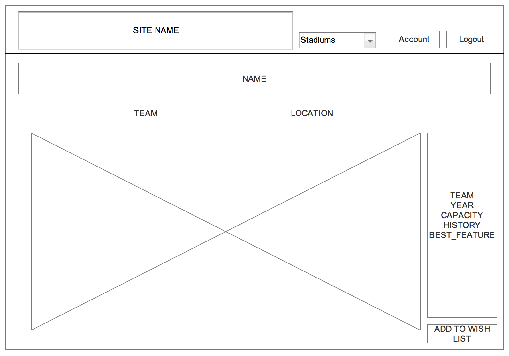

# Baseball Journal

 Baseball Journal is a basic CRUD app that was built using Ruby on Rails and is driven towards enhancing a baseball lover's stadium experience. The app gives users a space to store memories and photos from stadiums and games they have been to. There is also a public feature that allows anyone to view basic information about each stadium. A central place for all of your stadium needs.

#### App Link: https://baseball-journey.herokuapp.com

## Wireframes
#### Login Page

#### Sign-Up Page

#### Profile Page

#### Entry Page

#### Stadium Page

## Entity Relationship Diagram

## User Stories

| As a User I want:  |Goal:           |
| -------------       |-------------|
| To be able to enter the site     | To view and post material |
| To be able to edit my entries    | To have control over my content      |
| My profile to be secure and private | To be the only one who can access my content    |
| Visually appealing pages | To have incentive to come back to the site    |
| To see different pages for every team | To have facts about every team and stadium   |
| To be able to check off the stadiums I have been to | To keep track and plan future trips   |
| To be able see and edit all of the content in my profile| To edit my information, my posts, or delete my account |
| All of my posts to be organized and easy to read| To enjoy my experience on the site and recall past posts easily |

## Technologies/Frameworks Used
* Ruby
* Rails
* Bootstrap
* Sass
* JavaScript & jQuery
* HTML/CSS

## Future Improvements
* Allow users to comment on stadium pages to make it more social and interactive
* Add a wish list model so users can add stadiums to their wish list
* Allow user to add multiple pictures per entry
* Have a gallery of photos for each stadium and be source in schedules, rosters, etc. from their MLB sites
* Add other sports and their respective stadiums
* Improve quality of photos when you hover over them in the entries
